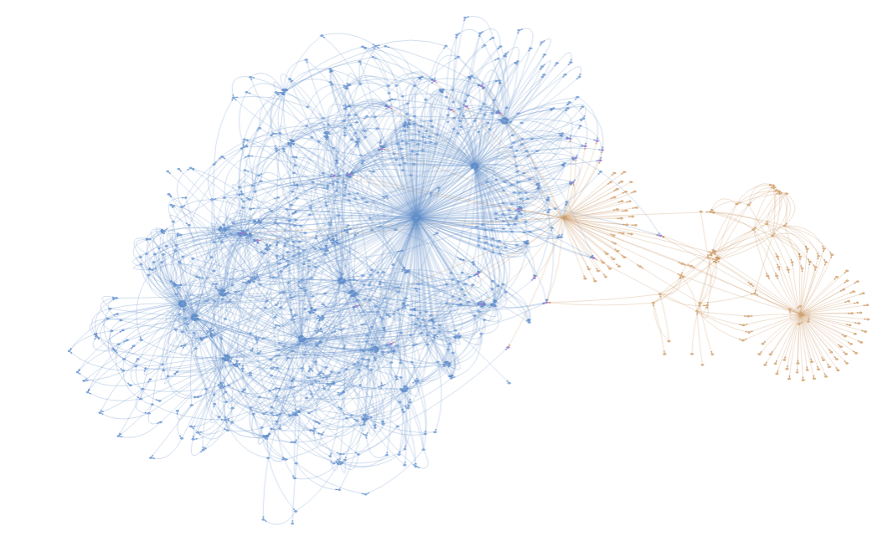

# Temporal Knowledge Graph Creation and Analysis
For Creation of Temporal Knowledge Graphs from ACLED and GTA datasets

# Datasets
## Final tKG dataset
* can be found in [data/](data/)
* `acled_subset_gta_aggregated_stat.txt`: number of unique nodes, number of unique relations
* `acled_subset_gta_aggregated_graph.txt`: all quadruples across all timesteps, file with 5 columns: subject, relation, object, timestamp, dataset identifier (1: acled, 0: gta)
* `acled_subset_gta_aggregated_ids_graph.txt`: same, but with node/relation identifiers instead of strings.
* `acled_subset_gta_aggregatedid_to_node.json`: mapping from node id to string
* `acled_subset_gta_aggregatedid_to_rel.json`: mapping from relation id to string
* `acled_subset_gta_aggregatednode_to_id.json`: mapping from string to node id 
* `acled_subset_gta_aggregatedrel_to_id.json`: mapping from string to rel id 

## Datasets used
* `.nt` files as can be found in [data/acled/](data/acled/) and [data/gta/](data/gta/)
* currently using: `gta_aggregated_2021.nt` and `acled_subset_2021.nt`

## Intermediate CSV files created
* `graph_gta_aggregated.csv`
* file with 7 columns: [0-2] GTA triples, [3] Announcement Date, [4] Implementation Date, [5] Removal Date, [6] GTA identifier
* if there has been no start date (announcement or implementation): default date 1000-03-03
* if there has been no removal date: default date 3000-03-03
* state_acts have no implementation date. instead they have an announcement date, and removal date. we artificially set the removal date to the removal of the latest connected intervention
* interventions have no announcement date
* `graph_acled_subset.csv`
* file with 7 columns: [0-2] ACLED triples, [3] Date, [4] Placeholder, [5] Placeholder, [6] ACLED identifier

# Ontology and mappings
* `.ttl` files as can be found in [data/acled/](data/acled/) and [data/gta/](data/gta)

# Steps for reproduction:
Perform the following steps in the provided order to create the tkg `.txt` files and produce analysis figures:

## 1. Queries for graph extraction
* instructions can be found in the [queries/](queries/) folder

### ACLED
* In the paper we use the output from [`acled_event_triples_subset_2021.rq`](queries/acled_event_triples_subset_2021.rq)
* Further possibilities:
    * [`acled_event_triples_2021.rq`](queries/acled_event_triples_2021.rq): without actor info, keep all type of triples 
    * [`acled_merged_event_triples_subset_2021.rq`](queries/acled_merged_event_triples_subset_2021.rq): aggregated ACLED events of same event type per country and actors

### GTA
* In the paper we use the result of the application of a sequence of SPARQL Update statements contained in [`gta_aggregated_sectors_products_2021_subset.ru`](queries/gta_aggregated_sectors_products_2021_subset.ru)
* details can be found [here](queries/)

## 2. Timestep assignement
`ts_assignment_acled.py` - for ACLED
* to read the `.nt` file and create above mentioned `graph_acled_subset.csv` (assign timestamp to each triple, filter out the triples that are not needed)

`ts_assignment_gta.py` - for GTA
* to read the `.nt` file and create above mentioned `graph_gta_aggregated.csv` (assign timestamps (announcement, implementation, removal) to each triple, filter out the triples that are not needed)

## 3. Merging the Datasets
`merge-tkg-from-gta-acled.py` - for merging the subgraphs
* to merge the two CSV files and create tKG txt file with quadruples

## 4. Analysis 
`analysis_main.py` - plot the analysis figures
* to create the analysis figures as presented in the paper (graph params over timesteps)

`visualisation_demo.py` - interactive visualisation
* to visualise each graph snapshot in the browser like the figure above
* with a slider to slide through timesteps
* possibility to zoom in/out for more or less finegrained view
* please wait for the visualisation of each timestep to converge
